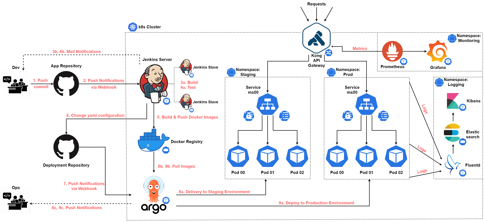

# DevOps

## A. Ops Phase
Tổng quan kiến trúc được áp dụng:



#
### 1. CI/CD
a. Tools:
- __Jenkins__: công cụ tích hợp liên tục (CI). Sử dụng để build, chạy test và trigger quá trình chuyển giao liên tục (CD).
- __ArgoCD__: công cụ chuyển giao liêu tục (CD). Ở đây, ta dùng ArgoCD để triển khai những cấu hình được định nghĩa trong git repository. Quá trình này gọi là *GitOps*.
- __Docker Registry__: một server lưu trữ docker images nhưng được deploy trong cùng cluster, không expose ra ngoài (như dockerhub nội bộ), chỉ jenkins có thể push docker images lên.

b. Implementation:
- Deploy Jenkins server lên k8s cluster
    - http://139.59.220.81/
    - username: vking34
    - password: vking34
- Deploy Docker Registry
- Deploy Argo
    - https://188.166.206.112/
    - username: admin
    - password: 
- Chuẩn bị 1 repository chứa source code của app. Demo: ```ci-cd/sample-app```
- Chuẩn bị 1 repository chứa những file cấu hình, deployment, ... của app trong những môi trường khác nhau. Demo: https://github.com/vking34/sample-app-deployments
- Xem chi tiết trong file ```ci-cd/README.md```

c. Flow
1. Dev thêm tính năng hoặc fix bug rồi __push__ lên repo. Ví dụ ở đây dùng Github

2. Github sẽ __gửi notifications__ về sự thay đổi của repo cho __Jenkins Server thông qua webhook__ *(được cài đặt trước với url: http://{jenkins-server-ip}/github-webhook)*

3. Build:
    - a. Build là một stage trong CI pipeline. Cách thức build app được script lại trong file ```ci-cd/Jenkinsfile```. Để tăng khả năng mở rộng, Jenkins Server không trực tiếp build app mà thay vào đó, ngay khi bắt đầu 1 pipeline, Jenkins Server __tạo ra các Jenkins Slave (chạy trên các pod khác)__. Sau đó giao nhiệm vụ cho các slave thực hiện phần còn lại của pipeline. Như vậy, có bao nhiêu pipeline cùng thực thi thì tạo ra mấy nhiêu slave pod và pipeline nào hoàn thành thì sẽ terminate pod tương ứng. Nhìn chung, ta mất chút thời gian khi khởi động slave pod nhưng đổi lại ta có thể tiết kiệm và sử dụng tài nguyên của hệ thống một cách hợp lý nhất.

    - b. Sau khi build, bất kể thành công hay thất bại thì Jenkins Server cũng gửi lại thông báo cho dev. Nếu lỗi thì gửi kèm logs để dev debug.

4. Test:
    - a. Cũng như build, cách thức test được script lại trong file ```ci-cd/Jenkinsfile``` và chạy trên cùng slave pod.

    - b. Sau khi test, trả về kết quả test cho dev.

5. Sau khi pass hết các test, đến stage ```Delivery```. Trước hết, jenkins slave sẽ build và push image lên registry để lưu trữ.

6. Jenkins slave sẽ clone ```deployment-repository``` về rồi sửa file cấu hình rồi lại push lên repo. Cụ thể, ta sửa tag của image trong file ```deployment.yaml```. Ví dụ: image của version hiện tại là ```sample-app:da6a18b```, sau khi build ta được và sửa thành ```sample-app:398b88d```.

7. Github gửi thông báo cho ArgoCD server về sự thay đổi của ```deployment-repository``` để ArgoCD pull về.
    - GitOps? Với các nền tảng hiện đại ngày nay đều hỗ trợ ta khai báo, quản lý cơ sở hạ tầng bằng code (Infrastructure as Code) như Docker, Kubernetes, AWS,... hay các tools quản lý cấu hình như Ansible, Terraform... Ta hiểu nôm na, GitOps là vận hành hệ thống bằng cách sử dụng Git. Ví dụ, ta upgrade version mới cho app, ta chỉ cần thay đổi code trong ```deployment-repository```, hệ thống sẽ lắng nghe sự thay đổi và tự động cập nhập theo cấu hình được định nghĩa trong repo. Hay ta muốn rollback lại version cũ, ta có thể reverse lại commit tương ứng với version ta mong muốn, khi đó hệ thống lại lắng nghe đổi và rollback lại version cũ.

    - ArgoCD mặc định sử dụng cơ chế polling. Cứ 3 phút lại check xem có sự thay đổi nào trên ```deployment-repository```. Nếu có thì sẽ pull về. Để linh hoạt hơn, ta có thể cài webhook cho argocd server để mỗi khi có sự thay đổi của repo thì sẽ nhận được thông báo qua webhook được setup trên repo *(với url: https://{agrocd-server-ip}/api/webhook/)*

8. Delivery:
    - a. Trong stage ```Delivery```, ta apply những file cấu hình trong directory ```staging``` cho môi trường *staging* (một môi trường gần giống môi trường *prod*). Ta có dùng namespace (Not best practices) hoặc cluster khác nhau để phân tác môi trường, các cấu hình không bị đè hay service gọi sai. Ví dụ ở đây namespace ```staging``` sẽ tương ứng với môi trường *staging*. Ngoài ra, ta có môi trường *dev*, *test* nhưng để vẽ sơ đồ đơn giản ta dùng 2 môi trường *staging* và *prod*.
    - b. Khi triển khai delivery một phiên bản mới, argo sử dụng image với tag mới được lưu trong registry

9. Deploy
    - a. Tương tự như stage delivery, stage ```Deploy``` sẽ triển khai cấu hình lên namespace *prod* sau khi tất cả mọi test đều pass và được phê duyệt bởi Ops engineer. Lúc đó cấu hình ở directory ```prod``` sẽ giống với cấu hình trong directory ```staging```.
    - b. Tương tự 8b